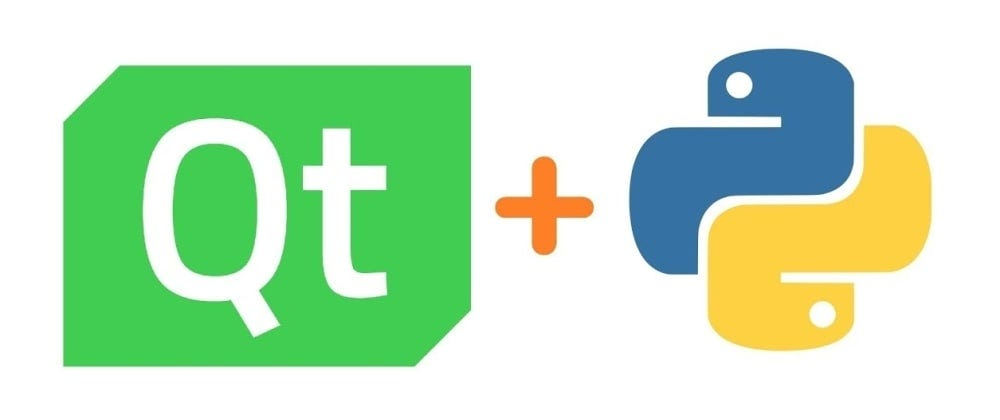

<!-- README.md -->
<!-- Creator: byte-engineer -->
<!-- Date: 1 / 11 / 2024  -->
<!-- This WorkShop For IEEE Team. -->

<!-- I will upload this project to my github page. -->
<!-- https://github.com/byte-engineer/GUIsDesignWS -->

Python GUIs Design
==================
**Author:** *byte-engineer*

# General Reveiw:
   * A workshop for designing Graphical User Interfaces `GUI` With python.
   * There is many python librarys To create 'GUI' like (PyGame, tkinter)
   * We Will Use A frameWork called 'PyQt5'.

# What are we aiming for?
   * We will learn about GUIs.
   * Some projects done with this frameWorks. 
   * Basics About PyQt.
   * We will jump to QtDesigner.
   * We will create a simple GUI for logging interface.

# What is GUIs?
   * It stand's for Graphical User Interface.
   * It make dealing with the programme way easier.
   * GUIs make the programmes accessable to non-programmers and normal people.
   * GUIs are closer to public use.
   * Almost all programmes has a front-end which care about designes and Back-end which care about main implementation.

## INFO About PyQt5 [^1]
   * This FrameWork has been written in C/C++ So, it's so responsive and fast.
   * This framework is open-source but It protected by GPL license.
   * The FrameWork has so many sub-modules like QtWidgets, QtCore, QtGui and many Others.
   * I will give you a cheat Sheet that I wrote my self. it contains most important functions and classes that you will need.
   * For ease we will use QtDesigner Because it has simple Drag-Drop interFace.
   * coding is more fluxable and suitable for large programms.
   * if you aim for a professional project (or you love programming) use direct code. 'quality tax'

[^1]: Actually we can use the recent version (PyQt6) but I used to older version (o_o). Also there is no big differece between thim.

## Requirements:

> ![NOTE]
> this requirments required if you want to Do the parctical application.

1. ### Laptop:
   * I recommend Windows 10/11 as an operating system.
   * NOTE: personally i don't know how to deal with macOS or linux So use it in your responsibility.
   * I don't know if this Will run on (portable devices like tablets or smartphone) but as i know python does not run on 'ARM' architecture. 
2. ### programming knowledge:
   * In this workshope, We will use python to deal with (Qt frameWork).
   * In this workshop I will NOT teatch you python basics.
   * But I will leave python cheat-sheet for learning python (So bueatifull and I spent on writing it handreds of hours literally) enjoy it 😊.
   * People who come from Other programming languages I think you will be able to understand python code easily it's easiest programming language in the earth. 
3. ### Install python 3.__ interpreter:
   * Official website: [pytohn](https://www.python.org/downloads/)
   * NOTE: Do NOT Forget to add python in your system PATH. ❗Please Please Please.
   
   * New macOS versions has python pre-installed as I know.
   * Make sure you installed 'pip' Official python package manager.
4. ### Install any General perpose Code editor.
   * We recommend visual studio Code (VSCode).
   * Please Don't use python IDE it's So bad.
5. ### Install Qtdesigner programme:
   * [Qt Designer](https://build-system.fman.io/qt-designer-download).
6. ### Download PyQt5 With `pip`:
   * Use this commend `pip install PyQt5`.
   * If you want To remove It later use the command 'pip uninstall PyQt5'.
   * Use vertual environment if you know it. But I will not use it for educatianal reasons.  Actually I don't care.
   <!-- * TODO: Does PyQt-tools Downloaded with the library?? -->

# QtDesigner
   * When you download the programme a small Window Will pop-up choose main window.
   * then directly start drag and drop.
   * QtDesigner is Generate file with `.iu` extinsion which is a file describes the UI features and elements.
   * Use this commend to convert ur project to to python file `pyuic5 -x app.ui -o app.py`.
   * You can view the emited file in any code editor you will notice that the is normal python file with PyQt5 library.
   * The file is unreadable and hard to understand it.
   * In most cases we access the `.py` Generated file as a library.
   * To access the file put it beside the main python file.

