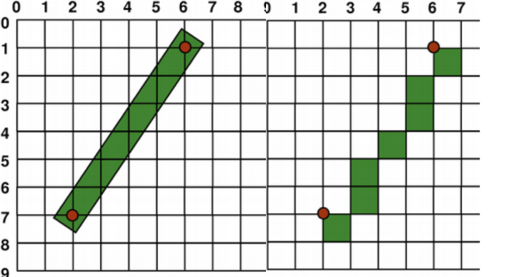
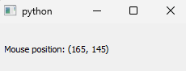

<!-- tutotial/0GUIs.md -->

How Does GUIs Work.
===================

## Basics
* In General the window interact with the user mouse clicks and keyboard events.
* Programmatically there is an infinite loop checks the user input every frame.
* This process usually handelled by the operating system.
* If a button clicked for example a certen function will be called and executed.

## Cordinate system
* The system API actually gives programmer an empty window (White or black)
* The library's function is to put a every pixel on it's place.
* The X-coordinate on computer sience is starting from the left to the right.  
* The Y-coordinate is starting from the top to the buttom.
* Some time we have some issues on drowing pixel's.

## Events
* Events are the response of the graphical UI to the user input (e.g mouse, keys)
* Actually PyQt5 has a greate setup for the responses.
* This are the main events in PyQt5 (QResizeEvent, QPaintEvent, QMouseEvent, QKeyEvent, and QCloseEvent.)
* Is prefered to use classes with them because thay are designed for OOP.
* There is an event triggered every frame implemented by the function `event`.
* You can run example `mouseEvent` and a small window will pop-up as shown on the figure bellow.

